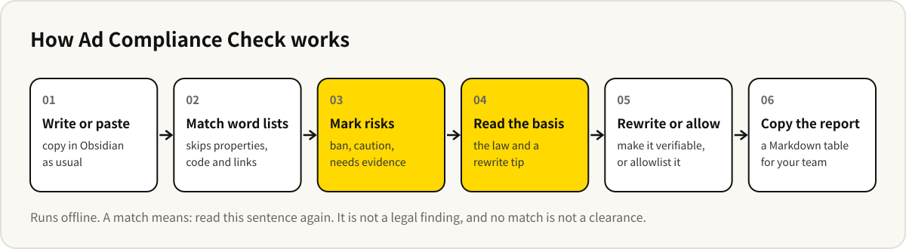

# Ad Compliance Check


English · [中文](README.md)

[](https://github.com/baocanmou/obsidian-ad-compliance-check/releases/latest)
[](LICENSE)
[](https://github.com/baocanmou/obsidian-ad-compliance-check/actions/workflows/lint.yml)
[](https://gitee.com/baocanmou/obsidian-ad-compliance-check)

An Obsidian plugin for people who write Chinese marketing copy — WeChat articles, Xiaohongshu notes, product pages, franchise ads. As you write, it marks expressions that carry risk under the Advertising Law of the People's Republic of China, and tells you why, which article applies, and how to rewrite.

Chinese name 发布前合规检查, plugin ID `ad-compliance-check`. It runs fully offline: no network, no AI calls, nothing from your notes leaves your device. The word lists and interface are in Chinese.

## Who it is for

- **Brands and shops writing their own copy**: opening posts, product launches, menu text. Phrases like 最佳 ("the best") or 国家级 ("national-level") are marked before you publish.
- **Agencies writing for clients**: each client has different red lines. Add stricter rules to one client's folder — for example, no treatment claims for a health brand — and they apply only there.
- **High-risk categories**: food, health food, cosmetics, education, real estate, franchising. The law has specific articles for these; the plugin has matching word lists you turn on when needed.
- **A record before handing over**: copy a report with line, phrase, issue and legal basis, and send it to the client or a colleague.

## What it does

- **Live marks in the editor**: wavy underlines — red for banned, orange for caution, blue for needs evidence.
- **Reason and basis on hover**: hover a mark to see the issue, the legal article and a rewrite tip, and allowlist it in one click.
- **Check panel**: a side panel lists every risky phrase by level, with context; click to jump to it.
- **Report**: copy a Markdown table with line, phrase, level, issue, basis and suggestion.
- **Ten built-in word lists**: four general lists on by default, six industry lists on demand.
- **Stricter rules per folder**: add industry lists and custom terms to one client's or column's folder.
- **Per-note settings**: add lists to one note, or switch checking off, through note properties.
- **Custom terms and allowlist**: with replacements, notes and regular expressions; allowlisted phrases are no longer marked.
- **Only the text you publish**: properties, code, link targets, wikilinks and comments are skipped.

## Example

A **fictional** opening post for a neighbourhood noodle shop, with two industry lists — disease and medical terms, food and health food — added in its note properties.


Left: marks in the editor. Right: the check panel — four banned, one needing evidence, each with the article it rests on and how to rewrite.

Hovering “3个月回本” ("pay back in 3 months"):


## How it works



## Built-in word lists

| List | Default | Examples | Main basis |
| --- | --- | --- | --- |
| Absolute terms (绝对化用语) | on | 最佳, 国家级, 全网最低, 首选, 全国首家 | Advertising Law Art. 9(3); SAMR guidelines on absolute terms |
| Efficacy and safety promises (效果与安全保证) | on | 根治, 100%有效, 无副作用, 立竿见影 | Advertising Law Art. 16, 17, 18, 28 |
| Franchise and return promises (招商加盟与收益承诺) | on | 稳赚不赔, 零风险, payback in N months, earn N a month | Advertising Law Art. 25 |
| Endorsements and honours (权威背书与荣誉) | on | 驰名商标, 特供, 专家推荐, 数据显示, 专利技术 | Advertising Law Art. 9, 11, 12; Trademark Law Art. 14 |
| Disease and medical terms (疾病与医疗用语) | off | 治疗, 消炎, 降血糖, disease names | Advertising Law Art. 17 |
| Food and health food (食品与保健食品) | off | 增强免疫力, 减肥, 零添加, 纯天然 | Food Safety Law Art. 73; Advertising Law Art. 18 |
| Cosmetics (化妆品) | off | 药妆, 祛疤, 生发, 零刺激 | Regulations on Cosmetics Art. 22, 43 |
| Education and training (教育培训) | off | 包过, 保证提分, 命题人, pass rates | Advertising Law Art. 24 |
| Real estate (房地产) | off | 升值空间, 投资回报, "N minutes to…", 学区房 | Advertising Law Art. 26 |
| Superstition (迷信内容) | off | 招财, 转运, 开光 | Advertising Law Art. 9(8) |

Every legal citation in the lists was checked against the original text. The full lists and each rule's explanation are in [src/packs.ts](src/packs.ts).

Common non-advertising uses are excluded: 第一步 ("step one"), 第一次 ("the first time"), 最好先做调研 ("you had better research first") and 最大的问题 ("the biggest problem") are not marked.

## Installation

**Community plugins**: once listed in the Obsidian community directory, search for “Ad Compliance Check” under **Settings → Community plugins → Browse**.

**Manual install** (use this until it is listed):

1. Download `main.js`, `manifest.json` and `styles.css` from [Releases](https://github.com/baocanmou/obsidian-ad-compliance-check/releases/latest).
2. Create `.obsidian/plugins/ad-compliance-check/` in your vault and put the three files there.
3. Restart Obsidian and enable “Ad Compliance Check” under **Settings → Community plugins**.

If GitHub is slow where you are, clone the Gitee mirror and build it yourself (Node.js 18+), then copy the same three files:

```bash
git clone https://gitee.com/baocanmou/obsidian-ad-compliance-check.git
cd obsidian-ad-compliance-check
npm install
npm run build
```

## Usage

1. Write as usual; risky phrases are marked. Hover a mark for the reason and a fix.
2. Click the shield icon in the ribbon, or run “打开检查面板” (open check panel), to see the whole note; click an entry to jump to it.
3. Click “复制检查报告” (copy report) in the panel, or run the command of the same name.
4. Under **Settings → Ad Compliance Check**, switch lists on and off, add custom terms and an allowlist, and set which folders are checked.

### Per-note settings

```yaml
---
合规词库: [疾病与医疗用语, 食品与保健食品]
合规检查: false
---
```

`合规词库` adds lists for this note; `合规检查: false` switches checking off for it. Both property names can be changed in settings.

### Custom terms

One rule per line; only the term is required:

```
term | level | replacement | note
门店之王 | 禁用 | 本地老店 | no ranking evidence
/保\d+年/ | 需依据
```

Levels are `禁用` (banned), `慎用` (caution) or `需依据` (needs evidence); caution is the default. Replacements add a “换成…” (replace with) button in the panel and hover card; separate several with `、`. A term written as `/…/` is a regular expression; lines starting with `#` are comments. A custom term overrides a built-in one on the same text.

### Stricter rules per folder

Under “按文件夹加严” in settings, pick a folder, tick the industry lists to add, and enter terms for that folder only. The rules apply to notes in that folder — handy for keeping each client's red lines.

### Commands

| Command | What it does |
| --- | --- |
| 打开检查面板 (open check panel) | Show every risky phrase in the current note in the right sidebar |
| 复制检查报告 (copy report) | Copy a Markdown table |
| 跳到下一处风险表达 (next risky phrase) | Select risky phrases one by one |
| 把选中文字加入白名单 (allowlist selection) | Stop marking the selected phrase |
| 把选中文字加入自定义词库 (add selection as custom term) | Added as caution; set level and replacement in settings |
| 开关编辑器实时标注 (toggle live marks) | Keep the panel, stop underlining in the editor |

## Limits

- **Matching, not understanding**: a match means "read this sentence again"; it is not a finding that the law is broken, and no match is not a clearance.
- **False positives happen**: the same word can mean different things, e.g. 卖得最好的三个产品 ("our three best-selling products") describes sales. Allowlist such cases.
- **Not legal advice**: for medical, health food, franchise or real estate content, follow the regulations and professional advice.
- **Text in images is not checked**: check posters and long images separately.
- **Rules change**: when laws or enforcement practice change, the lists need updating. Please open an issue for missing or outdated rules.

## FAQ

**Does it upload my notes?**
No. It makes no network requests; everything runs on your device and settings stay in your vault's plugin folder.

**Why is a word not marked?**
Industry lists are off by default. Turn them on in settings, for one note through the `合规词库` property, or for a folder with a folder rule.

**Can I add our own banned terms?**
Yes. Put them in “自定义词库” in settings for all notes, or in a client folder's rule for that client only.

**Does it work on mobile?**
It uses no desktop-only APIs and should run on Obsidian mobile, but it has only been tested on desktop.

**Will long notes slow it down?**
Notes over 300,000 characters are skipped to keep editing smooth.

## Versions

Current version **0.1.1**. Changes are listed under [Releases](https://github.com/baocanmou/obsidian-ad-compliance-check/releases).

Development:

```bash
npm install
npm run dev    # watch build
npm test       # engine tests
npm run lint
npm run build
```

## License and credits

**By BaoCanMou (包参谋)**  
**Initiated and directed by Yi Huiting (易慧庭)**

Released under the [MIT](LICENSE) license. The laws and regulations cited are public documents; the arrangement of the word lists and their explanations is MIT-licensed as well.

## Other BaoCanMou open-source projects

| Project | What it does | China mirror |
|---|---|---|
| [GEO Writing Check](https://github.com/baocanmou/obsidian-geo-writing-check) | Obsidian plugin: checks whether an article is easy for AI search to understand and cite | [Gitee](https://gitee.com/baocanmou/obsidian-geo-writing-check) |
| [Platform Ready Check](https://github.com/baocanmou/obsidian-platform-ready-check) | Obsidian plugin: checks a note against Chinese publishing platforms and keeps its sign-off current | [Gitee](https://gitee.com/baocanmou/obsidian-platform-ready-check) |
| [Restaurant Slogans: 10 Methods, 3 Picks](https://github.com/baocanmou/baocanmou-restaurant-slogan) | One restaurant tagline per method from ten masters, then three recommendations | [Gitee](https://gitee.com/baocanmou/baocanmou-restaurant-slogan) |
| [Plans into Presentations](https://github.com/baocanmou/baocanmou-plan-to-ppt) | Turns briefs and research into an editable, source-checked proposal deck | [Gitee](https://gitee.com/baocanmou/baocanmou-plan-to-ppt) |
| [BCM GEO Outcome Engine](https://github.com/baocanmou/bcm-geo-optimizer) | Diagnoses brand mentions, citations and recommendations in AI search | [Gitee](https://gitee.com/baocanmou/bcm-geo-optimizer) |
| [Open GEO SEO Console](https://github.com/baocanmou/open-geo-seo-console) | Self-hosted SEO and GEO monitoring console | [Gitee](https://gitee.com/baocanmou/open-geo-seo-console) |
| [BaoCanMou AI Skill Center](https://github.com/baocanmou/baocanmou-ai-skill-center) | Desktop app that catalogs local AI skills and links them to AI tools | [Gitee](https://gitee.com/baocanmou/baocanmou-ai-skill-center) |

## About BaoCanMou

BaoCanMou (包参谋) — Nanchang BaoCanMou Brand Planning Co., Ltd. — is a brand strategy and design company founded in 2012 in Nanchang, Jiangxi, China. We provide brand positioning, logo and visual identity, packaging, brand space and communication content, mainly for restaurants, chain stores, packaged food and regional specialty brands. Founder: Yi Huiting. Website: [www.bcmsj.com](https://www.bcmsj.com).

We work positioning first, design second. These tools come from work we repeat in client projects; we write the judgment criteria down so AI can follow the same standard.
