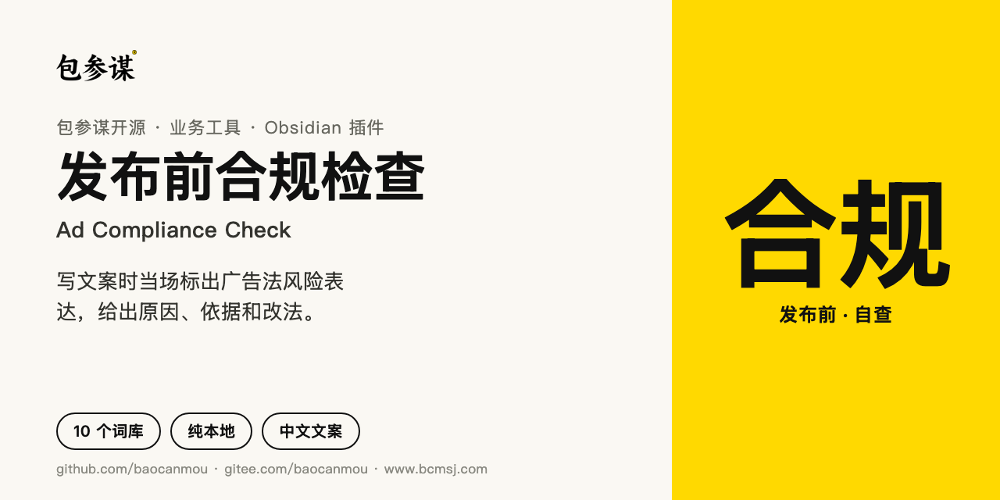
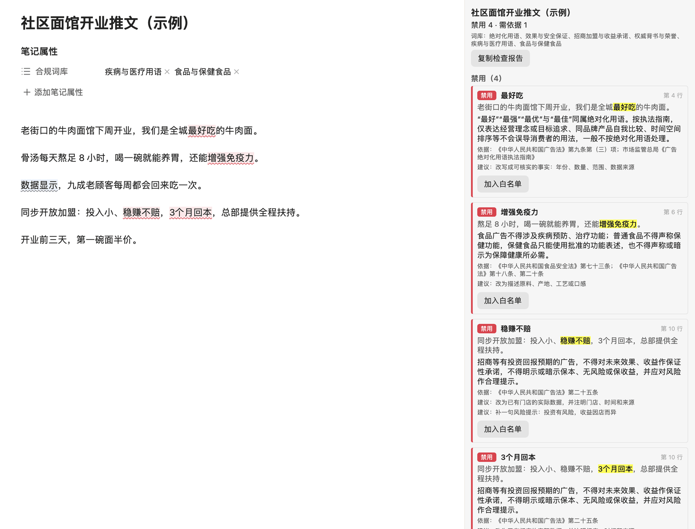
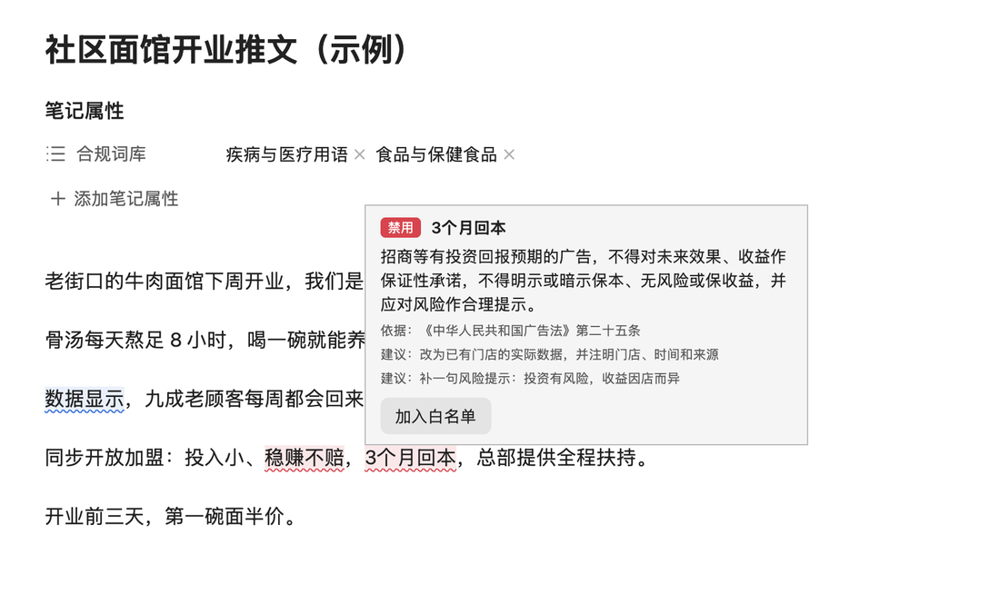
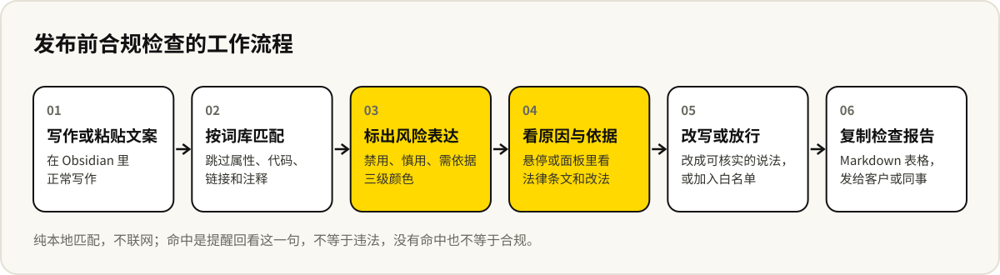

# 发布前合规检查



[English](README.en.md) · 中文

[](https://github.com/baocanmou/obsidian-ad-compliance-check/releases/latest)
[](LICENSE)
[](https://github.com/baocanmou/obsidian-ad-compliance-check/actions/workflows/lint.yml)
[](https://gitee.com/baocanmou/obsidian-ad-compliance-check)

一个 Obsidian 插件，给写公众号、小红书、商品详情和招商文案的人用：写作时当场标出广告法风险表达，说明为什么有风险、依据哪一条、可以怎么改。

插件英文名 Ad Compliance Check，插件 ID `ad-compliance-check`。纯本地运行，不联网，不调用 AI，不上传任何笔记内容。

## 适合谁、什么时候用

- **品牌和门店自己写文案**：开业推文、新品介绍、菜单说明，发出去之前过一遍，“最佳”“国家级”这类说法当场就能看到。
- **策划、代运营帮客户写稿**：每个客户的红线不一样。给客户的文件夹单独加严，比如健康类客户禁写疗效，只对这个客户的稿件生效。
- **高风险行业**：食品、保健、化妆品、教育培训、房地产、招商加盟。这些行业的广告法有专门条款，插件带对应词库，按需开启。
- **交稿前留痕**：一键复制检查报告，写明哪一行、什么问题、依据哪条法规，发给客户或同事确认。

## 能做什么

- **编辑器实时标注**：风险表达下方画波浪线，红色为禁用、橙色为慎用、蓝色为需依据。
- **悬停看原因和依据**：鼠标停在标注上，显示问题说明、法律条文出处和改写建议，可直接加入白名单。
- **检查面板**：侧边栏按级别列出全文所有风险表达，带上下文，点击跳到原文。
- **检查报告**：复制成 Markdown 表格，包含行号、表达、级别、问题、依据、建议。
- **10 个内置词库**：通用的 4 个默认开启，6 个行业词库按需开启。
- **按文件夹加严**：给某个客户或栏目的文件夹追加行业词库和专用禁用词。
- **单篇设置**：在笔记属性里为这一篇追加词库，或关闭检查。
- **自定义词库与白名单**：支持替换词、说明和正则表达式；白名单里的短语不再提示。
- **只查要发布的文字**：笔记属性、代码块、行内代码、链接地址、双链和注释不参与检查。

## 效果示例

下面是一篇**虚构的**社区面馆开业推文，在笔记属性里追加了“疾病与医疗用语”“食品与保健食品”两个行业词库。



左边是编辑器里的标注，右边是检查面板：禁用 4 处、需依据 1 处，每处写明依据的条文和改写方向。

鼠标停在“3个月回本”上：



## 工作流程



## 内置词库

| 词库 | 默认 | 内容举例 | 主要依据 |
| --- | --- | --- | --- |
| 绝对化用语 | 开 | 最佳、国家级、全网最低、首选、全国首家 | 广告法第九条第（三）项；市场监管总局《广告绝对化用语执法指南》 |
| 效果与安全保证 | 开 | 根治、100%有效、无副作用、立竿见影 | 广告法第十六、十七、十八、二十八条 |
| 招商加盟与收益承诺 | 开 | 稳赚不赔、零风险、几个月回本、月入几万 | 广告法第二十五条 |
| 权威背书与荣誉 | 开 | 驰名商标、特供、专家推荐、数据显示、专利技术 | 广告法第九、十一、十二条；商标法第十四条 |
| 疾病与医疗用语 | 关 | 治疗、消炎、降血糖及疾病名称 | 广告法第十七条 |
| 食品与保健食品 | 关 | 增强免疫力、减肥、零添加、纯天然 | 食品安全法第七十三条；广告法第十八条 |
| 化妆品 | 关 | 药妆、祛疤、生发、零刺激 | 化妆品监督管理条例第二十二、四十三条 |
| 教育培训 | 关 | 包过、保证提分、命题人、通过率 | 广告法第二十四条 |
| 房地产 | 关 | 升值空间、投资回报、几分钟直达、学区房 | 广告法第二十六条 |
| 迷信内容 | 关 | 招财、转运、开光 | 广告法第九条第（八）项 |

表中的法律条文引用已逐条核对原文。完整词表和每条规则的说明见 [src/packs.ts](src/packs.ts)。

常见的非广告用法已经排除，例如“第一步”“第一次”“最好先做调研”“最大的问题”不会被标出。

## 安装

**插件市场**：上架 Obsidian 社区插件目录后，可在 **设置 → 第三方插件 → 浏览** 中搜索 “Ad Compliance Check” 安装。

**手动安装**（上架前请用这种方式）：

1. 从 [Releases](https://github.com/baocanmou/obsidian-ad-compliance-check/releases/latest) 下载 `main.js`、`manifest.json`、`styles.css` 三个文件。
2. 在你的库里新建文件夹 `.obsidian/plugins/ad-compliance-check/`，把三个文件放进去。
3. 重启 Obsidian，在 **设置 → 第三方插件** 里启用 “Ad Compliance Check”。

国内访问 GitHub 较慢时，可以从 Gitee 镜像获取源码后自行构建（需要 Node.js 18 以上），构建出的三个文件同样放进上面的文件夹：

```bash
git clone https://gitee.com/baocanmou/obsidian-ad-compliance-check.git
cd obsidian-ad-compliance-check
npm install
npm run build
```

## 使用方法

1. 启用后直接写作，风险表达会被标出。鼠标停在标注上看原因和改法。
2. 点击左侧盾牌图标，或运行命令“打开检查面板”，查看整篇结果；点击条目跳到原文。
3. 在面板里点“复制检查报告”，或运行命令“复制检查报告”。
4. 在 **设置 → Ad Compliance Check** 里开关词库、填写自定义词库和白名单、设置检查范围。

### 单篇笔记设置

```yaml
---
合规词库: [疾病与医疗用语, 食品与保健食品]
合规检查: false
---
```

`合规词库` 为这一篇追加词库；`合规检查: false` 关闭这一篇的检查。两个属性名可在设置里修改。

### 自定义词库

每行一条，只有词语必填：

```
词语 | 级别 | 替换词 | 说明
门店之王 | 禁用 | 本地老店 | 无排名依据
/保\d+年/ | 需依据
```

级别写 `禁用`、`慎用` 或 `需依据`，不写按慎用处理。填了替换词，面板和悬停提示里会出现“换成…”按钮，多个替换词用顿号隔开。写成 `/…/` 的词语按正则表达式匹配，`#` 开头的行是注释。自定义词与内置词重合时，以自定义为准。

### 按文件夹加严

在设置的“按文件夹加严”里添加规则：选一个文件夹，勾选要追加的行业词库，再填这个文件夹专用的词语。规则只对该文件夹下的笔记生效，适合按客户管理红线。

### 命令

| 命令 | 作用 |
| --- | --- |
| 打开检查面板 | 在右侧栏显示当前笔记的全部风险表达 |
| 复制检查报告 | 复制 Markdown 表格 |
| 跳到下一处风险表达 | 依次选中文中的风险表达 |
| 把选中文字加入白名单 | 选中的短语不再提示 |
| 把选中文字加入自定义词库 | 以“慎用”加入，可在设置里补充级别和替换词 |
| 开关编辑器实时标注 | 只保留面板，不在编辑器里画线 |

## 边界

- **按词库匹配，不理解语境**：命中是提醒你回看这一句，不等于违法；没有命中也不等于合规。
- **会有误报**：同一个词在不同语境下性质不同，例如“卖得最好的三个产品”是在描述销售情况。遇到误报可以加入白名单。
- **不构成法律意见**：涉及医疗、保健食品、招商加盟、房地产等高风险内容，以监管规定和专业意见为准。
- **不检查图片里的文字**：海报、长图里的文字需要另外核对。
- **规则会变**：法规和执法口径调整后，词库需要更新。发现遗漏或过时的规则，欢迎提 Issue。

## 常见问题

**会上传我的笔记吗？**
不会。插件不联网，所有检查在本机完成，设置保存在库里的插件目录。

**为什么有些词没被标出？**
行业词库默认关闭。在设置里开启，或在笔记属性 `合规词库` 里为单篇开启，或用“按文件夹加严”给某个文件夹开启。

**能加我们公司自己的禁用词吗？**
可以。写进设置里的“自定义词库”，对所有笔记生效；只针对某个客户的，写进该客户文件夹的规则里。

**手机上能用吗？**
插件没有使用桌面端专有接口，理论上可以在 Obsidian 移动端运行，但目前只在桌面端验证过。

**很长的笔记会卡吗？**
超过 30 万字符的笔记不检查，以保证编辑流畅。

## 版本与更新

当前版本 **0.1.1**。各版本的变化见 [Releases](https://github.com/baocanmou/obsidian-ad-compliance-check/releases)。

参与开发：

```bash
npm install
npm run dev    # 监听构建
npm test       # 词库引擎测试
npm run lint
npm run build
```

## 许可与署名

**出品：包参谋 / BaoCanMou**  
**发起与产品方向：易慧庭 / Yi Huiting**

按 [MIT](LICENSE) 开源。词库中引用的法律法规条文属于公开文件，词库的整理与说明文字同样按 MIT 授权。

## 包参谋其他开源项目

| 项目 | 做什么 | 国内镜像 |
|---|---|---|
| [GEO 写作检查](https://github.com/baocanmou/obsidian-geo-writing-check) | Obsidian 插件：检查文章是否便于 AI 搜索理解和引用 | [Gitee](https://gitee.com/baocanmou/obsidian-geo-writing-check) |
| [平台成稿检查](https://github.com/baocanmou/obsidian-platform-ready-check) | Obsidian 插件：按公众号、小红书等平台检查成稿，管理文末落款 | [Gitee](https://gitee.com/baocanmou/obsidian-platform-ready-check) |
| [餐饮广告语·十法三选](https://github.com/baocanmou/baocanmou-restaurant-slogan) | 按 10 种名家方法各写一条餐饮广告语，比较后推荐 3 条 | [Gitee](https://gitee.com/baocanmou/baocanmou-restaurant-slogan) |
| [策划资料变 PPT](https://github.com/baocanmou/baocanmou-plan-to-ppt) | 把简报和调研做成有来源、可编辑的提案 PPT | [Gitee](https://gitee.com/baocanmou/baocanmou-plan-to-ppt) |
| [GEO 效果优化](https://github.com/baocanmou/bcm-geo-optimizer) | 诊断品牌在 AI 搜索中的提及、引用和推荐，按证据排改进任务 | [Gitee](https://gitee.com/baocanmou/bcm-geo-optimizer) |
| [Open GEO SEO Console](https://github.com/baocanmou/open-geo-seo-console) | 可自行部署的 SEO 与 GEO 监控后台 | [Gitee](https://gitee.com/baocanmou/open-geo-seo-console) |
| [包参谋 AI 技能中心](https://github.com/baocanmou/baocanmou-ai-skill-center) | 盘点本机 AI Skill 并统一连接多种 AI 工具的桌面应用 | [Gitee](https://gitee.com/baocanmou/baocanmou-ai-skill-center) |

## 关于包参谋

包参谋，全称南昌包参谋品牌策划有限公司，2012 年创立于江西南昌，提供品牌定位、Logo/VI 设计、包装设计、品牌空间与传播内容服务，主要服务餐饮、连锁门店、食品快消和地方特色品牌。创始人易慧庭。官网：[www.bcmsj.com](https://www.bcmsj.com)。

我们先定位，后设计。这些开源工具来自我们在实际项目里反复做的工作，我们把判断标准写清楚，让 AI 按同样的标准做事。
